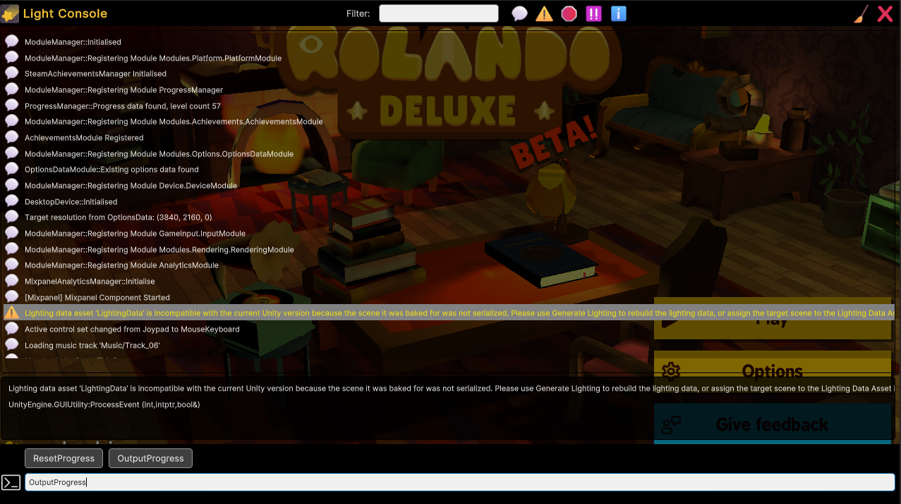

# 🌠 Light Console




Lightweight Console for Unity built using [UI Toolkit](https://docs.unity3d.com/Manual/UIElements.html) (the newer Unity UI system).
It adds a console to your runtime that allows you to see logs, execute commands and more.

**Please note** - currently only supports **Unity 2022.3** and later! It might work on earlier versions, but as UI Toolkit is
pretty new, I'm sticking to new versions.

**Warning** - This is a very early release - it will be subject to breaking changes and o there's a lot that is missing, and probably a lot of bugs - feel free to
send over any PRs or drop me a message on 🐤[Twitter](https://twitter.com/simonoliveruk),
🐘[Mastodon](https://mastodon.gamedev.place/@simonoliver), 🌥️[BlueSky](https://bsky.app/profile/simonoliver.com) or "SimonO" on Discord.


## Setting up


* Open the Package Manager window (Window → Package Manager) and and then select the Add Package icon in the top left of
  the window to add a git package.
* Enter ```https://github.com/simonoliver/LightConsole.git```
* Add LightConsole to your startup scene using ```Window → Light Console → Add Light Console to Active Scene```. This will detect
your current Input System and apply the correct behaviour to activate the console.
 
## Setting up activation

You can easily setup controls to activate the console. Depending on the input system you are using the LightConsole object will either have a ```InputSystemActivation``` or
```LegacyInputSystemActivation``` component. 

### New Input System

You can set the ```Activation Paths``` list on the InputSystemActivation component. These take the same format as Actions for the Input 
System, eg ```<Keyboard>/backslash``` or ```<Gamepad>/select"```. Any of these can be used to activate/deactivate the console.

### Legacy Input System

You can enter activation keys in the ```Activation Keys``` area.

## Options

LightConsoleController has the following options:

| Option                 | Description                                                                                              |
|------------------------|----------------------------------------------------------------------------------------------------------|
| Auto Show on Exception | Shows the console when an exception is thrown                                                            |
| Pause On Show          | Pauses the game when the console is shown                                                                |
| Enable Defines         | List of scripting define symbols to enable controle (see Enabling/Disabling LightConsole in builds below |


## Logs

The log viewer will show all output, with a visual indicator for log level (Log, Warning, Error, Exception, Assert). You
can filter by type using the toggle buttons at the top, or enter text into the filter box to filter by message content.

## Restyling

You can easily edit and replace the design using UI Builder - just copy the uxml files from the package Assets folder to
your project and assign to the LightConsole object.

Make sure you keep the element names the same as they are used to bind to various actions in the console.

## Registering commands

There are two different type of commands.

* Global Commands - they apply to a single object or function
* Instance Commands - Apply to a named instance of an object, useful if you have many similar objects (such as enemies, players)

Below are the different ways that you can register commands in the console,

### Using *ConsoleAction* Attribute

Add the ```[ConsoleAction]``` attribute to the methods of a class you want to register, and use
```LightConsoleCommands.RegisterGlobalObject``` or ```LightConsoleCommands.RegisterInstanceObject``` as below. These methods can be public or private. The first attribute parameter is the name that will appear on the command
button (spaces will be stripped). The second will appear on the tooltip - these are both optional (leave blank and it will use the method name).

```c#
void Start() {
    // Registers commands as global
    LightConsoleCommands.RegisterGlobalObject(this);
}

[ConsoleCommand("ChangeScale","Sets the scale to a random value")]
public void ChangeScale()
{
    transform.localScale = Random.Range(0.1f, 10) * Vector3.one;
}
```


### Using Action delegates

Just register the method directly, eg:

```c#
 void Start() {
    // Register a class method
    LightConsoleCommands.RegisterGlobalCommand(SetRandomRotation,"RandomRotation");
        
    // Register a lambda function
    LightConsoleCommands.RegisterGlobalCommand(
        ()=> { Debug.Log("Hello world!"); }
        ,"SayHelloWorld");
 }
    
 private void SetRandomRotation()
 {
    transform.localRotation=Quaternion.Euler(Random.Range(0,360),Random.Range(0,360),Random.Range(0,360));
 }
```


### Registering commands on instances

Say you have 4 players, called "Player1","Player2","Player3","Player4" and you want each to be affected by commands you can use RegisterInstanceObject:

```c#
void Start() {
    // Registers commands as an instance (requires dot access by name)
    LightConsoleCommands.RegisterInstanceObject(this);
}

[ConsoleCommand("Respawn","Respawn to start location")]
public void Respawn()
{
    transform.location=m_InitialLocation;
    Debug.Log($"Player {m_PlayerIndex} respawning");
}
```

This can then be called with ```Player1.Respawn```


## Executing commands

Global commands without parameters can be executed by either pressing the command button at the bottom, or entering the command in the console. eg ```SayHelloWorld```

Instance Commands can be executed with dot notation, eg ```Player1,Respawn```. Note that object name and command name are case insensitive when executing. 

For global commands that have parameters, these need to be passed on the console with commas seperating the parameters. So for a command

```c#
[ConsoleCommand("SetScale","Sets the scale of this object")]
public void SetScale(float x,float y, float z)
{
     transform.localScale = scale;
}
```

You would enter the command ```SetScale 1,2,3``` to pass all parameters

For multi-component types such as Vector3, enter each component separately eg for ```SetScale(Vector3 scale)``` just use```SetScale 1,2,3``` where 1,2,3 are x,y,z components

Supported types are:

* float
* int
* string
* Vector2 (components seperated by space, eg 1 2)
* Vector3 (components seperated by space, eg 1 2 3)
* Vector4 (components seperated by space, eg 1 2 3 4)
* Vector2Int (components seperated by space, eg 1 2)
* Vector3Int (components seperated by space, eg 1 2 3)
* Color (components seperated by space, eg 0.1 0.2 0.3 0.4)


## Enabling/Disabling LightConsole in builds

If you don't want the console to be included in specific builds, set the *Enable Defines* property on the *LightConsoleController*. If this is set, it will check to see if
any of these [scripting define symbols](https://docs.unity3d.com/Manual/CustomScriptingSymbols.html) are set for the current build and if none are found, the Light console game object will be destroyed.

Similarly, you'll want to wrap your command bindings to check for scripting define symbols, eg:

```c#
#if TESTER_BUILD
    LightConsoleCommands.RegisterGlobalCommand(SetRandomRotation,"Random Rotation");
#endif
```


## Unregistering commands

You'll sometimes want to unregister a command, for example if you leave a scene or an object is destroyed: 

### For global or instance objects

```c# 

void OnDestroy() {

    LightConsoleCommands.UnregisterObject(this);
}
```

### For Action Delegates

Keep a reference to the ```CommandData``` object, and pass back to unregister.

```c#
private CommandData m_DebugCommandData;

 void Start() {
        
    // Register a lambda function
    m_DebugCommandData=LightConsoleCommands.RegisterGlobalCommand(
        ()=> { Debug.Log("Hello world!"); }
        ,"SayHelloWorld");
 }
    
 private void OnDestroy()
 {
    LightConsoleCommands.UnregisterCommand(m_DebugCommandData);
 }
```


## Known issues

* Tooltips don't currently display (not supported in UI Toolkit at runtime, will need custom solution)
* Button's aren't filtered by text entry


## Acknowledgements

Contains Emoji from [Microsoft's Fluent UI Emoji Set](https://github.com/microsoft/fluentui-emoji)

This package is inspired by a number of excellent debugger tools, including the excellent [TouchConsolePro](https://www.opencoding.net/TouchConsolePro/)